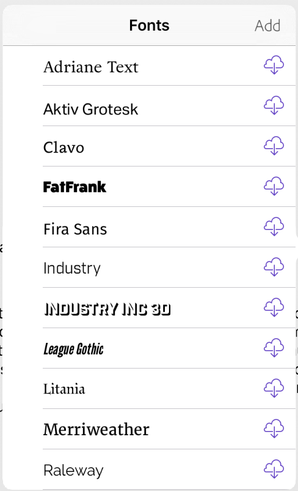
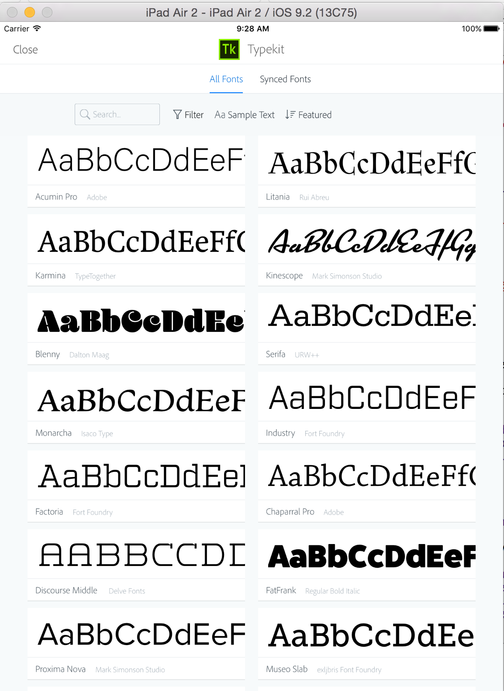
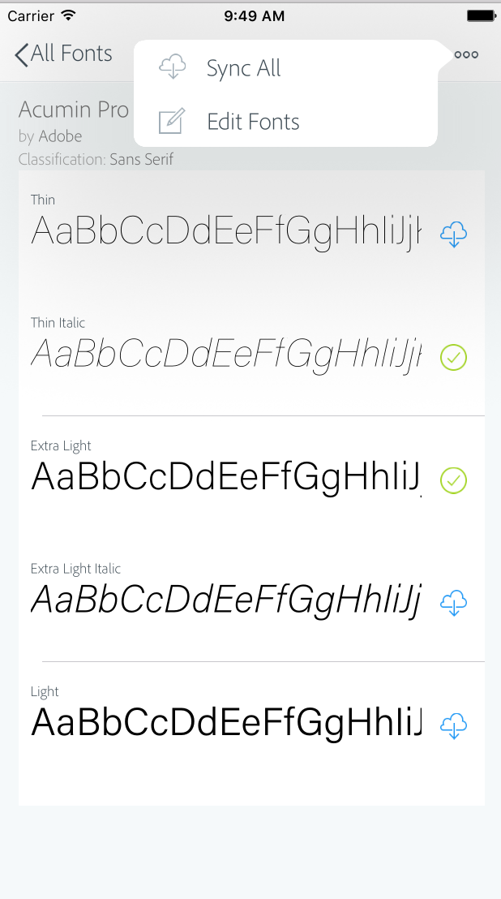

# Creative SDK Typekit

The Creative SDK Typekit provides a convenient UI for accessing Adobe Typekit fonts.

+ Let users browse through Typekit fonts available to use on mobile devices.
+ Let users sync Typekit fonts to their devices and use them locally.
+ Let users manage sync status of Typekit fonts.

## Contents

- [Prerequisites](#prerequisites)
- [Integrating the Typekit Component](#typekit)
- [Sample Code](#code)
- [iOS9 App Transport Security] (#ats)

<a name="prerequisites"></a>
## Prerequisites

+ This guide assumes that you've already read the <a href="/articles/gettingstarted/index.html">Getting Started</a> guide and have implemented Auth.
+ Authenticating your application to Typekit Platform service that is available in November 2016 release or later requires 2 Typekit scopes. Please visit creativesdk.com and add Typekit service to your application. In your application, add the following 2 scopes to `additionalScopeList` parameter of `[AdobeUXAuthManager setAuthenticationParametersWithClientID:clientSecret:additionalScopeList:]` method.

 - AdobeAuthManagerTypekitPlatformScope
 - AdobeAuthManagerTypekitPlatformSyncScope

+ Framework Dependencies: The following frameworks are required to use Creative SDK Typekit.

 - AdobeCreativeSDKCore
 - AdobeCreativeSDKCommonUX
 - AdobeCreativeSDKTypekit
 - libc++.tbd
 - libz.tbd

<a name="typekit"></a>
## Integrating Typekit

*You can find the complete `Typekit` project for this guide in <a href="https://github.com/CreativeSDK/ios-getting-started-samples" target="_blank">GitHub</a>.*

### Typekit Component Explanation

There are several UI components in Creative SDK Typekit framework.

- AdobeTypekitFontPickerController – provides a list of Typekit fonts currently synced to the users account + bundled fonts

- AdobeTypekitFontBrowserController – displays all Typekit font families available to the user, tapping on a family takes the user to the family details view. Adding a font from the details view adds it to the user’s synced fonts set.

- AdobeTypekitFamilyDetailsController - displays details for a Typekit font family. The user can sync, unsync and download selected fonts.

Unlike the desktop products where syncing a font adds the font to the synced set and downloads it, the mobile product does not automatically download fonts that are in the synced fonts set. Mobile devices are constrained by memory, disk space, and network bandwidth and in order to be well behaved on the platform, fonts are downloaded using the font picker when the user taps the cloud icon.

The bundled fonts are product specific and allows the user to have a non-empty font picker when they first create their CC account since by default no fonts are part of the sync set. Per guidance from the Typekit team, fonts should only be added to the synced set as a result of a user action. The bundled fonts are not synced to the account until the user taps the cloud icon in the font picker. At that time the font is both added to the synced set, and downloaded for use.

### Bundled Fonts

Some Adobe open-source fonts can be bundled with Creative SDK Typekit framework. These bundled fonts pre-populate the Font Picker. For example, when a user who has not synced any font logs in an app with Creative SDK Typekit integrated, the user sees the bundle fonts in the Font Picker.

Management of bundled fonts is in the application so that the app has full control over the set of bundled fonts. To set up bundled and default fonts, follow samples in typekit_fonts folder inside Code/TypekitSample/Objective-C/Typekit


### UI

- Authentication is performed using the `CreativeSDKCore AdobeUXAuthManager` class. This is required for the Typekit server APIs to work correctly.

- Once the user logs in, clicking on the 'Launch Font Picker' button will launch the AdobeTypekitFontPickerController UI.  If the user already synced some fonts to the user's Adobe ID, the Font Picker shows a list of font families for the synced fonts and the bundled fonts.



- Click 'Add' button on the top right of the Font Picker will bring the user to the Font Browser.



- Tapping on a font family in the Font Browser will bring the user to the Font Family Details, where the user can sync and unsync fonts.
- The green checkmark on the Font Detail cell indicated that the font is synced and downloaded
- The cloud icon on a Font Detail cell indicated that the font is not synced, tapping on the cloud icon will sync and download the font to the device
- To unsync or sync multiple fonts in this font family, select 'Edit Fonts' in the menu then select/deselect the cell and hit 'UPDATE FONTS'



- Tapping on 'Synced Fonts' in the Font Browser will bring the user to the syned fonts list. Swiping left on any row in the synced fonts list reveals the Delete button. Tapping the button unsyncs the selected font and it becomes no longer usable on the device.

 

<a name="code"></a>
### Code

Prior to using any Typekit APIs, you need to do the followings:

1. Setup authentication using `AdobeUXAuthManager` class. Typekit Manager must have the app clientID from AdobeUXAuthManager.

   Use the following method to setup authentication with `AdobeUXAuthManager` class. Include `AdobeAuthManagerTypekitPlatformScope` and `AdobeAuthManagerTypekitPlatformSyncScope` in the additional scope list.

```
[[AdobeUXAuthManager sharedManager] setAuthenticationParametersWithClientID:YourAPIKey
                                                                   clientSecret:YourClientSecret
                                                            additionalScopeList:@[AdobeAuthManagerUserProfileScope,
                                                                                  AdobeAuthManagerEmailScope,
                                                                                  AdobeAuthManagerAddressScope,
                                                                                  AdobeAuthManagerTypekitPlatformScope,
                                                                                  AdobeAuthManagerTypekitPlatformSyncScope]];

[AdobeUXAuthManager sharedManager].redirectURL = [NSURL URLWithString:YourRedirectURL];
```

2. Call the `syncFonts` method at least once

```
[[AdobeTypekitManager sharedInstance] syncFonts];
```

#### Launching the Typekit Font Picker Controller

Create a UIViewController and use the following code to launch the AdobeTypekitFontPickerController

```
- (IBAction)launchFontPickerHandler:(id)sender
{
    AdobeTypekitFontPickerController *vc = [AdobeTypekitFontPickerController new];
    vc.pickerDelegate = self;
    vc.currentFont = [AdobeTypekitFont fontWithName:self.currentFontName];
    vc.pickerType = AdobeTypekitFontPickerFamilies; //or AdobeTypekitFontPickerFonts depends on the pickerType
    vc.modalPresentationStyle = UIModalPresentationPopover;

    UIPopoverPresentationController *popoverPresentationController = vc.popoverPresentationController;
    popoverPresentationController.sourceView = self.view;
    popoverPresentationController.delegate = self;
    popoverPresentationController.permittedArrowDirections = UIPopoverArrowDirectionAny;

    [self presentViewController:vc animated:YES completion:nil];
}

#pragma mark - AdobeTypekitFontPickerControllerDelegate
- (void)fontPicker:(AdobeTypekitFontPickerController *)controller didFinishPickingFont:(AdobeTypekitFont *)typekitFont
{
    if (typekitFont != nil)
    {
        // get the UIFont then assign it to the text field
        // font is nil if the Typekit font is not synced or the user is no longer entitled to use the font
        UIFont *font = [typekitFont uiFontWithSize:15 withDescriptorAttributes:nil];
    }
}

## UIAdaptivePresentationControllerDelegate

- (UIModalPresentationStyle)adaptivePresentationStyleForPresentationController:(UIPresentationController *)controller traitCollection:(UITraitCollection *)traitCollection
{
    // use font picker as popup style for both iphone and ipad
    return UIModalPresentationNone;
}

```

#### Apply Typekit Font to Text View
- Text View (TextContainerView in the sample app)
 1. Extend `UITextView` class
 2. Add a property to store a Typekit font. Refer to `tkFont` in the sample app.
 3. Add a setter to the property and apply the Typekit font to the `font` property. Refer to `setTkFont:` in the sample app.

- Controller Hosting Text View (ViewController in the sample app)
 1. Implement Font Picker. Refer to Launching the typekit Font Picker Controller section above.
 2. Implement `fontPicker: didFinishPickingFont:` delegate method
 3. Add observer for the notification dispatched when Typekit font is changed. Refer to `viewDidLoad` in the sample app.
 4. Add a notification handler. Refer to `typekitChanged:` in the sample app.

<a name="ats"></a>
## iOS 9 App Transport Security
Typekit Sample App uses `Allow Arbitrary Loads` for iOS 9 App Transport Security settings. To configure ATS exceptions fully, please refer to [How To Build the Creative SDK Properly for iOS 9](https://creativesdk.zendesk.com/hc/en-us/articles/206347815-How-To-Build-the-Creative-SDK-Properly-for-iOS-9-Build-v-0-11-or-Older-).
